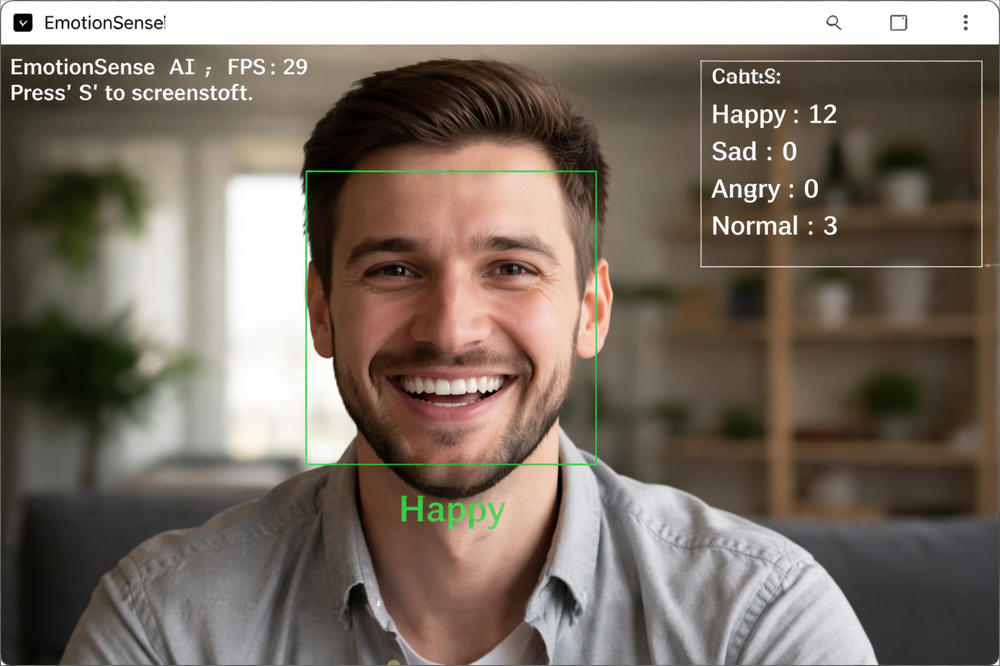

# EmotionSense AI 🎭

EmotionSense AI is a **real-time emotion detection system** that uses a webcam to
detect human emotions such as **Happy, Sad, Angry, and Normal** using
**Computer Vision and Deep Learning**.

The project is built using **Python, OpenCV, and DeepFace**, and it also supports
conversion into a **Windows desktop EXE application**.

---

## 📸 Application Preview



---

## 🚀 Features

- Real-time webcam emotion detection
- Face detection with bounding boxes
- Emotion classification:
  - 😄 Happy
  - 😢 Sad
  - 😡 Angry
  - 😐 Normal
- Live FPS (performance counter)
- Emotion statistics counter (on screen)
- Screenshot capture using keyboard
- Emotion data saved to CSV
- Mood analysis graph shown after exit
- Windows EXE support with custom icon

---

## 🛠️ Technologies Used

- Python
- OpenCV
- DeepFace
- TensorFlow
- Matplotlib
- NumPy

---

## 📁 Project Structure

```

EmotionSense-AI/
│
├── src/                 # Main application source code
│   ├── emotion_detector.py
│   └── face_detection.py
│
├── models/              # Haarcascade and detection models
│   ├── haarcascade_frontalface_default.xml
│   └── haarcascade_frontalcatface.xml
│
├── assets/              # Icons and images
│   ├── emotion.ico
│   ├── emotion.png
│   └── screenshotex.png
│
├── tests/               # Test scripts
│   └── test_camera.py
│
├── README.md
├── requirements.txt
└── .gitignore

````

---

## ▶️ How to Run the Project

### Step 1: Clone the repository
```bash
git clone https://github.com/ShehanRUSL/EmotionSense-AI.git
cd EmotionSense-AI
````

### Step 2: Install required libraries

```bash
pip install -r requirements.txt
```

### Step 3: Run the application

```bash
python src/emotion_detector.py
```

---

## ⌨️ Keyboard Controls

* **Q** → Quit the application
* **S** → Take a screenshot

📌 Screenshots and logs are saved in the project directory.

---

## 📊 Output Files

* `emotion_log.csv` → Emotion data with timestamps
* Screenshot images (`.png`)
* Emotion summary bar graph (shown after exit)

---

## 🖥️ Desktop Application (EXE)

This project can be converted into a **Windows `.exe` desktop application**
using **PyInstaller**.

The EXE version includes:

* Webcam access
* Real-time emotion detection
* Emotion statistics
* Custom application icon

---

## 📌 Use Cases

* AI & Machine Learning learning projects
* Computer Vision practice
* University / academic mini-projects
* GitHub portfolio projects

---

## 📄 License

This project is created for **educational and learning purposes**.
